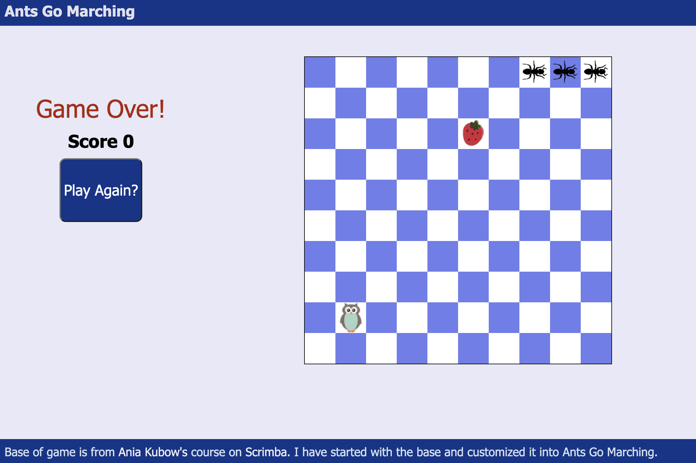

# AntsGoMarching

* "AntsGoMarching" is a simple snake-style game based in JavaScript. March your ants to victory by eating as much picnic food as you can without running your trail of ants into each other or off of the blanket. Watch out for the hungry owls!

* Base of game is from Ania Kubow's course on Scrimba https://scrimba.com/learn/snakegame. I have started with the base and customized it into Ants Go Marching.

* Play game at https://caitlinw29.github.io/AntsGoMarching/

## Screen-Shots

